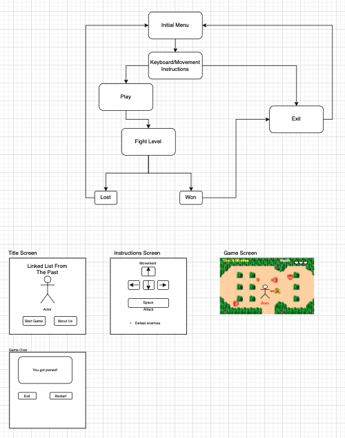
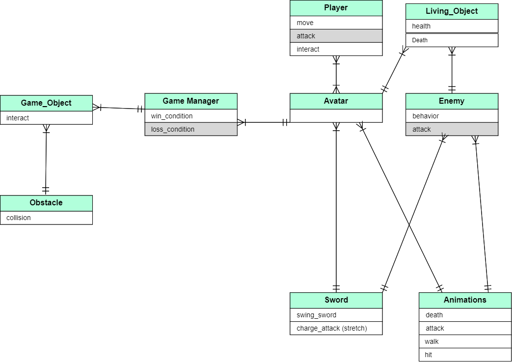

# A Linked_List_To_The_Past

Team:
Bionca Bond
David Kariuki
Michael Greene
Taylor White

A simple game made in pygame that is similar to Zelda.

[Communication Plan and Conflict Resolution Agreements](https://docs.google.com/document/d/1sxQ-36FK0KuXtHxJafk7SfMc3hJT4hAxr0C4Z5-2EWg/edit?usp=sharing)

## Software Requirements

### Vision

**A 2d overhead adventure game made in pygame.**
+ **What pain point does this project solve?**
  + Allows for classic 2d gaming on the go.
+ **Why should we care about your product?**
  + For fans of old school adventure games from the NES, this game will appeal to their sense of nostalgia.

### Scope (In/Out)

+ **IN - What will your product do**
  + Users can move in 4 directions.
  + Users can use a weapon to defeat enemies.
  + Users can solve puzzles to win the scenario.
  + Users can be defeated by enemies.

+ **OUT - What will your product not do?**
  + Will not feature multiple levels.
  + Will not track player's score.

### Minimum Viable Product

+ Player life, ability to be defeated.
+ 2d sprites and animation for combat.
+ Ability to attack and defeat enemies.
+ Basic interaction with environment for puzzle solving.

### Stretch goals?

+ Music, sounds
+ Multiplayer
+ Multiple weapons
+ Boss Creature
+ **What stretch goals are you going to aim for?**
  + Audio
  + Multiple Weapons

### Functional Requirements

+ User starts a new game at the title screen,
+ User controls hero, able to attack and defeat enemies.
+ User can interact with environment.
+ User will return to title screen if defeated.
+ User will be congratulated with a win screen upon victory.

### Data Flow

+ Application starts, team logo is displayed then user is brought to title screen.
+ Starting at the title screen begins a new game, a "how to play" message is presented to the player first.
+ Beginning the game puts the player into a dungeon room.
+ Enemies and puzzle objects can be interacted with.
+ Losing all their health returns the player to the title screen.
+ Upon completion of the win condition, the user is brought to a win screen where they may return to the title menu or quit the app.

### Non-Functional Requirements

+ **Usability** - Game will need to be able to be played on multiple platforms.
+ **Testability** - Game will require a little outside testing to help find unexpected behaviors.

## Wireframe

## Domain Model

## User Stories

### Movement
+ As a user, I want to be able to walk around the map in 4 directions so that I can attach and evade enemies.
+ **Feature Tasks**: Movements up/down/right/left with keyboard commands.
+ **Acceptance Test**: Ability to move throughout the whole map/areas

### Graphics
+ As user, I want to have bright and colorful graphics so that I can easily see enemies and obstacles vividly.
+ **Feature Tasks**: Game will display 2d sprites. Background textures should be distinct from enemies, items, and projectiles.
+ **Acceptance Test**: Background colors should be unsaturated when compared to enemies' and the player's sprites to make a stark distinction between them.

### Weapons
+ As a user, I want to be able to use a weapon to defeat enemies so that I can feel challenged and advance to different rounds.
+ **Feature Tasks**: User should be able to damage and and kill enemies.
+ **Acceptance Test**: Enemies should perform a 'hit' animation to give feedback as to when they've been hit and a 'dying' animation to confirm they're defeated.

### Obstacles
+ As a user I should be able to avoid object/obstacles e.g. rocks so that I can continue to progress through the current round.
+ **Feature Tasks**: Obstacles and enemies provide collision to the player.
+ **Acceptance Test**: Obstacles should block player movement, enemies should harm the player as well as block movement.

### Enemies
+ As a user I need to know when all enemies are eliminated so that I can advance to the next round.
+ **Feature Tasks**: User should be alerted when they have won the game.
+ **Acceptance Test**: A win screen is displayed upon victory.
